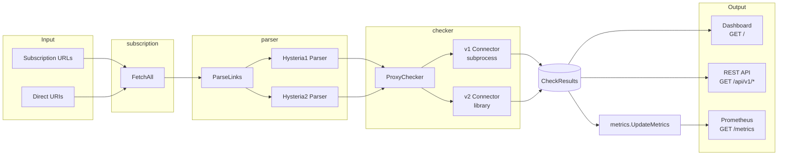
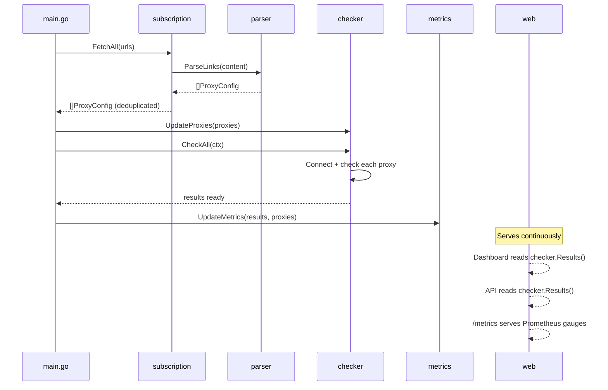

# Architecture

This page describes how Hysteria Checker is structured internally — the major components, how they connect, and how data flows from subscription URLs to your dashboard and metrics.

## System Overview

## Components

### main.go — Orchestrator

The entry point ties everything together. On startup it:

1. Parses configuration via `config.Parse()`
2. Fetches subscriptions and parses proxy configs
3. Creates a `ProxyChecker` with v1 and v2 connectors
4. Runs an initial health check and publishes metrics
5. Starts the HTTP server (dashboard, API, metrics)
6. Enters an event loop that periodically refreshes subscriptions, re-checks proxies, and updates metrics
7. Handles graceful shutdown on SIGTERM/SIGINT

### config — Configuration

Manages all application settings through CLI flags and environment variables using the [Kong](https://github.com/alecthomas/kong) library.

Key settings include subscription URLs, check interval and timeout, check method (IP comparison or HTTP status), server bind address, authentication credentials, and log level. See the [Configuration](configuration.md) reference for the full list.

### models — Data Model

Defines `ProxyConfig`, the core data structure that represents a parsed proxy server:

| Field | Description |
|-------|-------------|
| `Version` | Protocol version (1 or 2) |
| `Server` | Host and port |
| `Auth` | Authentication credential |
| `SNI` | TLS Server Name Indication |
| `Obfs` / `ObfsParam` | Obfuscation type and password |
| `StableID` | Deterministic SHA256 hash for deduplication and metric labels |

The `StableID` is computed from a combination of server address, auth, version, SNI, obfuscation, and protocol fields. It serves as the primary key for tracking proxy identity across subscription refreshes.

### parser — URI Parsing

Converts `hysteria://` and `hysteria2://` share links into `ProxyConfig` objects. The package contains:

- **parser.go** — `ParseLinks()` splits multi-line input and dispatches each URI, `ParseLink()` routes to the version-specific parser
- **hysteria1.go** — Parses `hysteria://host:port?params#name` URIs with query parameters for auth, protocol, obfuscation, bandwidth, and TLS settings
- **hysteria2.go** — Parses `hysteria2://` and `hy2://` URIs with support for port hopping specs like `443,5000-6000` in the host field

See [URI Formats](uri-formats.md) for the full format specification.

### subscription — Subscription Fetching

Handles fetching proxy lists from remote URLs:

- Detects direct links (`hysteria://`, `hysteria2://`, `hy2://`) and parses them immediately
- For subscription URLs, fetches HTTP content, attempts base64 decoding (multiple encoding variants), then parses the result
- `FetchAll()` aggregates proxies from all configured URLs and deduplicates by `StableID`
- Partial failures are logged but don't block operation — if one subscription fails, others still load

### checker — Health Checking

The core monitoring engine. `ProxyChecker` manages concurrent health checks across all proxies.

**Connector interface** — An abstraction that allows different implementations per protocol version:

- **Hysteria1Connector** — Shells out to the `hysteria` v1 binary as a subprocess, creates a local SOCKS5 proxy, and routes the check request through it. Includes a minimal RFC 1928 SOCKS5 client implementation.
- **Hysteria2Connector** — Uses the Hysteria v2 Go client library directly. Supports port hopping via UDP hop connections and Salamander obfuscation.

**Check flow** for each proxy:

1. Connect via the version-appropriate connector
2. Make an HTTP GET request through the proxy to the check URL
3. Validate the result based on the configured check method:
    - **IP method** — Confirms the proxy's exit IP differs from the host's public IP
    - **Status method** — Confirms an HTTP 200 response
4. Record the result: alive/dead, latency, timestamp, and any error

Checks run concurrently with a concurrency limit of 5.

### metrics — Prometheus Metrics

Publishes two Prometheus gauge metrics:

- `hysteria_proxy_status` — `1` if alive, `0` if down
- `hysteria_proxy_latency_ms` — Round-trip latency in milliseconds (`0` if down)

Both carry labels for `version`, `address`, `name`, and `id`. Metrics are reset and republished after each check cycle to remove stale entries for proxies that have been removed from subscriptions. See [Metrics](metrics.md) for PromQL examples and alerting rules.

### web — HTTP Server

Provides three interfaces for accessing check results:

- **Dashboard** (`GET /`) — Server-rendered HTML page showing proxy status, latency, and aggregate counts with auto-refresh. Uses Go's `html/template` for XSS-safe rendering.
- **REST API** (`GET /api/v1/*`) — JSON endpoints for proxy listing, individual proxy lookup, and status summary. Supports optional sensitive data redaction. See [API Reference](api-reference.md).
- **Metrics** (`GET /metrics`) — Prometheus exposition endpoint.

All endpoints can be protected with HTTP Basic Auth via the `middleware` package, which uses constant-time credential comparison for timing-attack safety.

### middleware — Authentication

Provides `BasicAuth` HTTP middleware using `crypto/subtle.ConstantTimeCompare()` for secure credential validation. Applied conditionally based on the `METRICS_PROTECTED` configuration flag.

## Data Flow

The application follows a straightforward pipeline that repeats on a timer:

1. **Fetch** — `subscription.FetchAll()` downloads proxy lists from all configured subscription URLs, decodes them, and deduplicates by `StableID`
2. **Parse** — Each raw URI passes through `parser.ParseLink()`, which routes to the Hysteria v1 or v2 parser and returns a `ProxyConfig`
3. **Check** — `ProxyChecker.CheckAll()` runs concurrent health checks through version-specific connectors, producing a `CheckResult` for each proxy
4. **Publish** — Results flow to three outputs:
    - `metrics.UpdateMetrics()` resets and repopulates Prometheus gauges
    - The dashboard handler reads results on each page load
    - API handlers return results as JSON on request

This cycle runs once at startup and then repeats every `CHECK_INTERVAL` seconds. Subscription URLs are also re-fetched on each cycle, so proxy additions and removals are picked up automatically without restarts.

